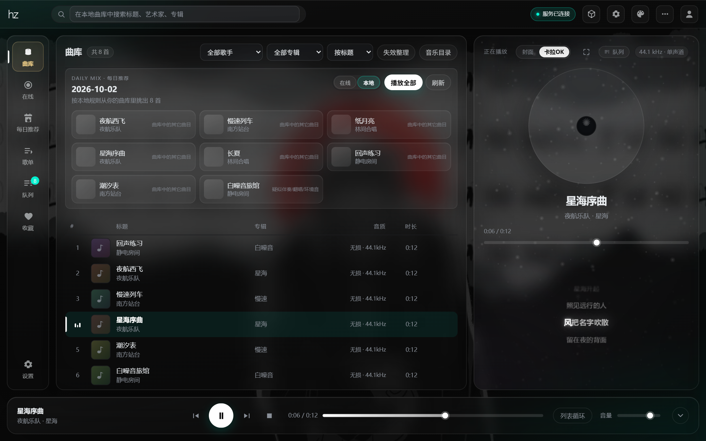
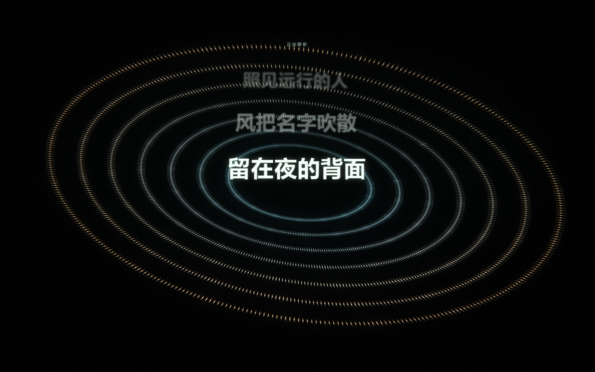
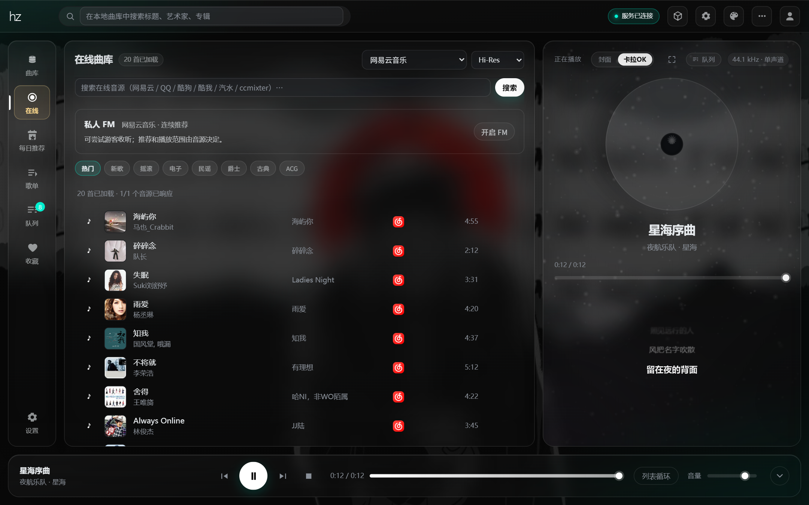
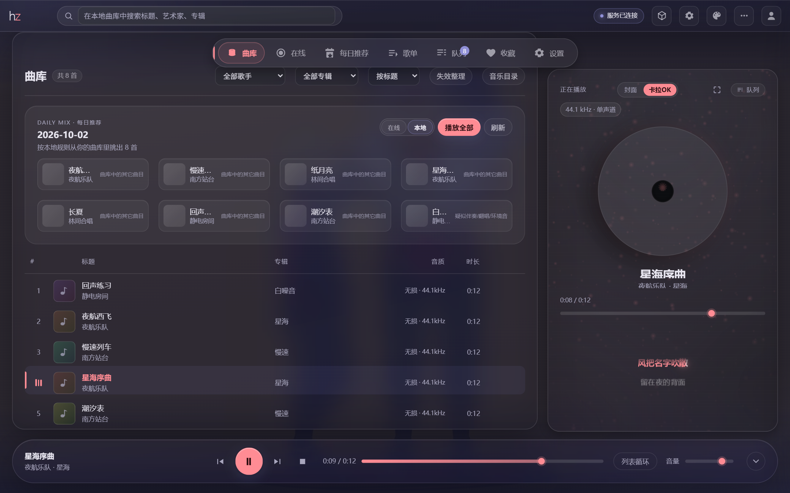

# Hertz Studio

一个本地优先（local-first）的音乐服务与播放器：单个 Rust 进程负责解码、播放、曲库与歌词，
界面是零构建的原生 JS/CSS。同一份业务逻辑与同一份前端跑在两种形态里——
独立二进制（自带 HTTP 与 WebSocket 服务，由服务自己托管界面）与 DBX 插件（stdio JSON-RPC sidecar，
界面打进 `.dbxp`）。

本地优先：播放、曲库、歌词、歌单、设置全部在你自己的机器上完成，断网也能用。
在线曲库浏览是显式启用的附加能力，由本机服务代理解析，不上传你的曲库、收听记录或任何个人数据。



---

## 特性

**播放与曲库**

- 真实的本地播放：`symphonia` 解码 → `cpal` 输出。扫描收录 mp3 / flac / wav / m4a / aac /
  alac / ogg / aiff 等 13 种扩展名；其中 opus、ape、wma 只是收得进库，symphonia 0.5 没有对应
  解码器，点播会如实报错而不是假装在播
- 播放控制：播放、暂停、停止、跳转、音量、上一首 / 下一首、三种播放模式（重复 / 单曲 / 随机），
  一首结束自动续播；睡眠定时到点自动暂停
- 实时频谱：64 段 FFT，约 30 fps 推到界面
- 本地曲库：目录扫描、内嵌标签与封面提取、增删自动同步、标题 / 艺术家 / 专辑搜索；
  排序与分页都在服务端完成，点播用**完整筛选结果**作为队列；搜索关键词留历史
- 音乐目录管理：添加、启停、移除目录，监听文件变化自动增量扫描；支持手动扫描、取消与失败明细，
  移除目录不删音乐原文件
- 歌词：读取音频同目录 `.lrc`，支持普通歌词与**逐字时间轴**（enhanced LRC）、`[offset:]`；
  来源优先级为手动导入 > 音频内嵌标签 > 同名 `.lrc`，支持每曲 ±0.5s 偏移（持久化）
- 自定义歌单：增删改、曲目增删与顺序维护；M3U 导入导出；可混存本地与在线曲目（元数据快照随单持久）
- 曲库管理：专辑 / 歌手筛选、曲目信息编辑（覆盖层，重扫保留）、批量编辑 / 收藏 / 加入歌单、
  替换封面、失效文件整理；缺失的歌手与专辑可以从在线音源联网补全
- 数据备份：歌单 / 收藏 / 设置 / 曲库目录一键导出导入（JSON，不含凭据，幂等恢复）
- 音效：六段 EQ、ReplayGain 响度归一化（关 / 按曲 / 按专辑，带预增益）、软限幅、
  已准备本地/缓存曲目的双流衔接与可调交叉淡化；不满足衔接条件时正常切歌，
  [支持边界](docs/aegis/adr/0007-playback-transitions-and-intent-ownership.md)
- 播放历史：分页、来源筛选与搜索，可回放
- 远程来源（WebDAV）：登记服务器（密码进钥匙串）、目录浏览、导入曲库并以 HTTP Range 直链播放
- 系统凭据：平台 cookie 等秘密存入操作系统钥匙串，启动自动迁移旧明文数据
- 开发者选项：一键开启**播放诊断日志**（默认关闭），逐条记录音源与音质选择、缓存命中、
  每个地址的成败与原因；在线流地址只留 `host/path`，不含账号凭据。异常退出会留下编号并显示在
  设置页，这一条不受诊断开关控制

**首页与交互**

- 首页「正在播放」卡按当下状态只给一个主动作：继续播放 / 查看队列 / 选一首继续听 /
  播放最近一首 / 添加音乐；旁边是最近播放与每日名言（可在设置里关掉）
- 命令面板 `Ctrl+K`：搜曲、播放控制、切皮肤与舞台、跳设置，可钉住、记最近使用，
  还认队列方言（例如按歌手从队列里剔除）
- 顶栏搜索默认搜在线，可切歌单 / 歌手 / 专辑；切到本地档就是曲库筛选

**歌词舞台与三维**

- 沉浸式歌词舞台：逐字染色（普通 LRC 也按字摊时间轴）、行内进度插值、按距离衰减的排版节奏、封面取色
- 全屏 3D 视角：拖拽旋转、按行景深视差、自动漂移、双击复位；纯 CSS 3D，文字仍是 DOM，清晰可点可读屏
- 四种歌词视觉：流光 classic、心象 cadenza、商籁 sonnet（Pixi 电影镜头）、凝彩 tempera（色块分镜 MV）；
  **星诞 starborn** 不自己画字，只在四者之间按歌曲自动选镜；字幕条是独立开关，可与任一视觉共存
- 沉浸声场：极光穹顶、折跃隧道、音域地形、引力星球、棱镜星系、共振星环、封面星球七种场景；
  频谱驱动局部形变与节拍波纹，数字 **1–7** 切场景、**L** 切歌词、**Q** 队列、**F** 全屏、
  **B** 换布局、**K** 复位、**V** / **Esc** 返回
- 舞台粒子层：封面周围的稀疏柔光随律动缓慢呼吸，节拍轻泛涟漪，为歌曲信息与歌词留出安静区域；
  可选 WebGL2 增强渲染，带代价探测与自动降级
- 3D 歌单架：CSS 3D 扇形排布，唱片封套式卡片与随频谱呼吸的舞台地面；只渲染窗口内的十几张，
  看不见的卡片不建 DOM、不取封面
- 创意舞台：手写 WebGL2 内核（零顶点缓冲、频谱走纹理、RGBA8 后处理链）+ 可寻址参数表 +
  编排 cue 轨 + 音频绑定 + 自动导演 + 创意工坊 + 手绘风格 + 自定义背景；歌词本身也是一种三维场景；
  「一句成景」用离线规则编译器把一句描述确定性地编成舞台意图，无网络、无模型、无随机数，
  编排结果可编成一段分享码交给另一个人
- 录制歌词视频：把当前舞台导出 720p / 1080p / 竖屏，可带系统声音。仅独立形态可用——
  插件沙箱里没有本地歌词数据源，导出请改用浏览器打开的主界面
- 歌词输出到直播 / 录屏软件：一个只读的歌词浮层页配一把只读钥匙（只能读浮层与封面，
  碰不到播放控制与曲库），三种排版，可挂自定义背景与台标



**在线曲库**

- 音源注册表驱动：网易云 / QQ 音乐 / 酷狗 / 酷我 / 汽水 / 咪咕 / CCmixter / Jamendo，
  搜索、详情、歌词、试听与封面全部由本机服务代理并归一化成同一套字段；前端的选择框与分类
  由服务端的能力表生成，加一个音源不用改前端
- 登录：填入**你自己**在该站点的账号 cookie（服务端持久化、永不回显原文），或网易云 / QQ / 酷狗 / 汽水扫码；
  私人 FM 目前仅网易云
- 音质：标准 / 高品 320k / 无损 / Hi-Res 四档可选，实际取流按**这一首歌**的运行时代码上限逐级下探，
  失败自动重试下一档，并在界面上说明这首实际给到的是哪一档
- 在线歌单可读写：新建、删除、加曲、移曲，也能按名字搜平台上的歌单 / 歌手 / 专辑
- 在线缓存管理：占用统计、按音源清理、指定曲目豁免 LRU 回收
- 曲源自动接力：某首在线曲的音源失效时，按标题 + 歌手 + 时长在其它音源找到同一首并续播，
  界面说明这次换走了哪家；可在设置里关掉
- 听歌打卡：网易云在线曲有效收听满 30 秒后代你向平台上报一次收听记录，默认开启、可关，
  界面提示只代表请求已发出，不替你断定播放量已经增加
- 每日推荐：本地规则引擎 + 各平台每日推荐汇总（只取已登录平台，未登录、该平台没有这个能力、
  上游失败都记进「已跳过」而不是弹一个错误）
- 咪咕：官网登录后导入含 `pacmtoken` 的 Cookie，验证账号；支持公开歌单分页与普通音频播放，权限限制按平台响应显示。
- 汽水：二维码使用当前手机授权入口；抖音 App 确认仍待本人验收，上游要求安全验证时可在官网登录后导入 Cookie。



**中文点播播客**

- 独立播客栏目，通过 Apple Podcasts 中文目录搜索节目，也可导入发布者公开 RSS。
- 支持订阅、单集简介、分页、刷新和播放；单集进入原有队列与历史，重启或取消订阅后仍保留单集身份。
- 支持公开分发的 MP3/M4A 等有限长度音频；直播电台与平台私有付费节目不在此入口。每个 RSS 最多解析 16 MiB、收录 2000 个可播放单集。

**外观**

- 七套布局皮肤：经典 classic（默认）/ 浮光 sheen / 工作台 workbench / 流年 liunian /
  OS 风 ios / 清风 qingfeng / 潮汐 chaoxi。皮肤只管布局，配色一律跟当前主题走，
  所以换皮肤不会把主题色带跑，换主题也不破坏布局
- 18 套内置主题色 + 7 套二次元主题 + 自定义配色；文字色由底色按 WCAG 反推，不是手写
- 主题工作室：壁纸背景（内置 12 张，缩略图选择与独立压暗）、自定义配色、自动压暗
- 设置持久化在服务端 SQLite，不依赖浏览器 localStorage



**工程**

- 默认只监听回环地址。入口链接带的是**两分钟即废的一次性票据**——这条 URL 会进浏览器历史、
  终端滚动缓冲和聊天记录，所以不把长期令牌写进去；长期令牌只留在本机文件与请求头里。
  绑到非回环地址时启动会打一行警告
- 三档设备档位（按核心数、内存与渲染像素判定，运行期只允许往下修正），歌词与舞台帧门对应
  20 / 30 / 60 fps，弱机自动降密度与刷新率
- 协议版本独立于软件版本演进；宿主握手不匹配时应拒绝连接而不是猜字段
- DBX 插件通过一层与传输无关的门面共用曲库、播放、在线账号与舞台业务，最低宿主版本为 0.6.35

**规划中**

- DSP 二期：升采样、参数 EQ、卷积 IR、EBU R128 响度归一化、真峰值限幅、噪声整形、交叉馈送、饱和
- Windows WASAPI 独占模式

---

## 快速开始

```bash
# 构建（需要 Rust 1.88+；下界由依赖图声明，见 workspace 的 rust-version）
cargo build --release

# 运行独立形态（Windows 下产物是 target\release\hertz-studio.exe）
./target/release/hertz-studio

# 或者一步到位，并自动打开浏览器
cargo run --release -- --open
```

启动后终端会打印界面入口（默认 `http://127.0.0.1:7634/`，后面跟着一张一次性入口票据）、
健康检查地址，以及服务发现文件的位置。

在 UI 左侧填入音乐目录 → 点「扫描」→ 点击曲目即可播放。

常用参数：

| 参数               | 说明                             |
| ---------------- | ------------------------------ |
| `--bind ADDR`    | 监听地址，默认 `127.0.0.1`          |
| `--port PORT`    | 端口，`0` 表示随机空闲端口，默认 `7634`  |
| `--data-dir DIR` | 数据库、封面缓存、令牌的存放位置       |
| `--open`         | 启动后打开浏览器（走系统 `cmd`，只在 Windows 生效） |
| `--version`      | 打印版本后退出                        |

环境变量：`VMUSIC_BIND` `VMUSIC_PORT` `VMUSIC_BACKEND`（`null` = 不出声）
`VMUSIC_LOG` `VMUSIC_DATA_DIR`；另有 `VMUSIC_SECRETS=memory` 仅用于测试 / CI（凭据只存进程内）。

### DBX 插件形态

`plugin/` 是同一套逻辑与同一套前端的插件形态：

- `plugin/backend/` 编译出 sidecar 二进制 `dbx-plugin-hertz`，经 stdio JSON-RPC 与宿主通信；
  数据目录由宿主指定，未设置时回落到独立数据目录之外的专属子目录
  （避免两个进程同时写同一个 SQLite）
- `plugin/ui/` 打进 `.dbxp`；界面靠 `plugin/ui/host.js` 这层宿主适配收敛差异
  （资源 URL 补全、opaque origin 下的 localStorage 替身），其余前端代码不感知自己跑在哪个宿主
- `plugin/manifest.json` 声明 workbench + command + 菜单项；`plugin/dbx-plugin.toml` 是打包配置
  （只带 `assets` 与 `ui`，没有 npm 步骤）
- 打包用上游 dbx 仓库的 `dbx-plugin` CLI（未随本仓库分发），产物落在 `plugin/dist/`

sidecar 只做传输：把宿主的调用转成与 HTTP 响应同构的返回值，服务端事件经同一条广播总线下发，
两种形态的事件口径一致，业务实现只有一份。
**当前状态**：`crates/hertz-studio/src/rpc/` 已覆盖曲库、播放、歌单、推荐、播客、远程来源与设置，
与 HTTP 复用同一套服务实现；`scripts/check-plugin-sidecar.js` 验证信封、路由与事件契约。
真实平台账号和原生宿主的验收范围见[联调记录](docs/aegis/work/2026-10-08-extension-live-integration/90-evidence.md)。

---

## 架构

```
┌─ 表现层 ────────────────────────────────────────────────┐
│  内置 Web UI（零构建）· DBX workbench · curl             │
└───────────────┬─────────────────────────┬───────────────┘
                │                         │
┌─ 传输 ────────┴───────────┐   ┌─────────┴───────────────┐
│ 独立形态：HTTP + WebSocket │   │ 插件形态：stdio JSON-RPC │
└───────────────┬───────────┘   └─────────┬───────────────┘
                │        rpc（JSON 门面）  │
┌─ hertz-studio 逻辑库 ─────┴─────────────┴───────────────┐
│  bootstrap  数据目录 → 可用的 AppState（两种形态同一条路）│
│  state      播放队列、事件总线、服务发现文件              │
│  scan       后台扫描，进度经事件总线广播                  │
│  online     音源注册表：契约 + 分发 + 落盘缓存             │
│  podcasts   中文播客目录与 RSS，用户给的地址逐跳校验       │
└───────────────────────────┬─────────────────────────────┘
                            │ 命令队列（单消费者）
┌─ audio actor（专用线程）───┴─────────────────────────────┐
│  串行执行所有播放命令，唯一的播放状态写入者                │
│  快照无锁发布，频谱在 actor 线程计算                       │
└───────────────────────────┬─────────────────────────────┘
                            │ AudioBackend trait
┌─ 后端 ────────────────────┴─────────────────────────────┐
│  CpalBackend   解码线程 → 环形缓冲 → cpal 回调 → 声卡     │
│  NullBackend   不出声，确定性时序，供测试与 CI 使用        │
└─────────────────────────────────────────────────────────┘
```

拆成逻辑库的约束很实际：`AppState` 有一批 `pub(crate)` 字段（`radio`、`online_meta`、
`downloads`、`quality`、`keep`、`protected` 等），插件的 dispatcher 必须留在本 crate 内部才碰得到，
所以 `rpc` 门面在 `crates/hertz-studio` 里而不在 `plugin/backend`。

**核心设计取舍**

| 主题     | 选择                       | 原因                                         |
| ------ | ------------------------ | ------------------------------------------ |
| 并发     | 单消费者命令队列 + 无锁快照 | 播放操作之间有严格的时序约束，用串行化代替加锁；读多写少的状态用无锁快照       |
| 音频回调   | 独立于 tokio 的 OS 线程        | 回调里 `await`、抢锁或分配内存都会爆音                    |
| 事件下发   | 广播队列满时**丢帧**而不是断开     | 状态帧每拍全量重发，缺几帧增量无所谓；断开会让客户端走指数退避，退避窗口里界面停在旧状态 |
| Web 框架 | axum                     | 类型安全 extractor、与 tokio 同源；本服务瓶颈在音频而非路由       |
| 数据访问   | sqlx 运行时校验（非 `query!` 宏） | 无需 `.sqlx/` 元数据即可离线构建，CI 更简单；所有语句由集成测试覆盖   |
| 搜索     | SQLite FTS5（trigram）+ LIKE 复核 | `%关键词%` 只有 trigram 索引服务得了；索引粗筛后仍由 LIKE 收敛，结果与改造前逐字一致 |
| 重采样    | 线性插值                     | 依赖轻、代码可审计；`AudioBackend` 是替换成 sinc/FIR 的接缝 |
| 前端     | 零构建原生 JS                 | `cargo run` 之后就能直接用，不引入 npm 工具链            |
| 双形态    | 逻辑库 + 两个薄传输壳            | 传输只有三处差异（routes / ws / sidecar），业务只写一份      |

REST 路由清单不写在 README 里，见 [docs/api-routes.md](docs/api-routes.md)，
那份清单由脚本从路由源码生成、并在 CI 里校验一致性。

---

## 在线音源的边界

接入网易云音乐、QQ 音乐、酷狗音乐、酷我音乐、汽水音乐、咪咕音乐，以及 CCmixter 与 Jamendo
两个 CC 授权开放曲库（Jamendo 需在 devportal 免费注册一个 client_id，填进设置才启用，
未配置时这个音源自动隐藏）。对接用的是两类东西：
平台**网页端 / 自家客户端公开使用的端点**（含这些端点要求的请求签名，如酷狗的 MD5 签名、
QQ 的搜索签名与取流凭据、酷我移动端的变形 DES 载荷），和**用户自己账号的凭据**
（cookie 或扫码登录）。平台客户端签名算法是项目所有者明确授权实现的（设计决策 D7）：
仅在用户本机、以用户本人凭据发起请求，不分发平台内容、不做商业服务，全部代码为原创实现。

红线不变，具体不做的事：

- 不解密受技术保护措施保护的音频（DRM / CENC / 加密容器一律不碰）；
- 不绕过付费墙，也不模拟会员权益判定（VIP 歌曲在界面上如实置灰）；
- 不伪造设备指纹，也不实现平台未公开的私有付费内容接口；
- 不在服务里存放别人的账号，也不做账号池 / 凭据共享。

能力失败一律如实上报：某源没有的能力直接回答「不支持」，聚合搜索里失败的源进失败列表，
而不是被伪装成空结果。

凭据的处理：cookie 写入系统凭据保险库，读取设置时不回显凭据，也不接受把凭据写进设置键。
界面上的「已登录」只是本机存着凭据的提示，登录弹窗会再向平台确认账号是否仍然有效。
服务默认只监听回环地址且需要本地令牌，平台凭据只发给对应平台的官方接口。

加一个音源的成本写在[扩展指南](docs/extension-guide.md)里：一个平台源文件 + 一条注册项，
界面由能力表自动驱动。播客注册成独立的媒体种类，通过同一个播放器取流，但不参加音乐搜索、
每日推荐或歌曲换源匹配；播客目录与 RSS 是另一条服务链路。

---

## 配置

首次运行会在数据目录生成 `config.toml`（可直接编辑），环境变量优先级更高。

```toml
[server]
bind = "127.0.0.1"
port = 7634

[audio]
backend = "cpal"        # 或 "null"（不出声，用于测试）
volume = 0.8
spectrum_bands = 64

[library]
extensions = ["mp3", "flac", "wav", "m4a", "aac", "ogg", "oga", "opus", "ape", "wma", "aiff", "aif", "alac"]
follow_symlinks = false

[online]
cache_max_bytes = 2147483648   # 在线音频缓存上限，默认 2 GiB

[log]
level = "info"          # 例如 "hertz_studio=debug,vmusic_audio=info"
format = "pretty"       # pretty | json
```

（生成的文件里还有一个 `server.expose_ui`，目前没有任何代码读它，属于预留键。）

数据目录默认位置：Windows `%LOCALAPPDATA%\hertz-studio`，
macOS `~/Library/Application Support/hertz-studio`，Linux `~/.local/share/hertz-studio`。
其中含 `vmusic.db`（曲库）、`cache/covers/`（封面）、`cache/online/`（在线音频缓存）、
`token` 与 `overlay-key`（两份彼此独立的凭据，后者只读）、`vmusicd.json`（服务发现文件，
宿主据此拿到端口与令牌）。开启播放诊断日志后还有 `logs/playback.log`
（单文件上限 2 MiB，超出裁掉最旧的一半）。

---

## 目录结构

```
hertz-studio/
├── migrations/              数据库迁移（启动时自动执行）
├── crates/
│   ├── vmusic-core/         领域模型、AudioBackend trait、错误分类
│   ├── vmusic-audio/        NullBackend / CpalBackend + 命令 actor
│   ├── vmusic-store/        SQLite 仓储（sqlx 运行时校验）
│   ├── vmusic-library/      目录扫描、元数据与封面、歌词文件查找
│   ├── vmusic-lyrics/       LRC 解析（含逐字时间轴）
│   ├── vmusic-beats/        离线节拍分析：STFT 频谱通量 → 峰值 / BPM / 强拍分型
│   └── hertz-studio/        服务逻辑库 + 独立形态二进制
│       ├── src/lib.rs       业务逻辑库：两种宿主共用同一份
│       ├── src/bootstrap.rs 进程装配：数据目录 → 可用的 AppState
│       ├── src/rpc/         与传输无关的 JSON 门面（DBX 插件形态走这里）
│       ├── src/routes.rs    独立形态的 REST 路由表
│       ├── src/ws.rs        独立形态的事件推送
│       ├── src/podcasts/    播客目录、RSS 解析与订阅存储
│       └── src/online/      音源注册表：provider（登记与能力门）· netease · qq · kugou ·
│                            kuwo · qishui · migu · ccmixter · jamendo ·
│                            mod（分发与缓存）· ladder / progressive / quality（取流阶梯）
├── plugin/                  DBX 插件形态：与独立形态共用逻辑库和前端
│   ├── manifest.json        插件清单（workbench + command + menus）
│   ├── dbx-plugin.toml      打包配置
│   ├── assets/plugin.svg    插件图标
│   ├── backend/             sidecar 二进制 dbx-plugin-hertz：stdio JSON-RPC 薄壳
│   ├── vendor/dbx-plugin-sdk/  DBX 官方 SDK 副本（未发布到 crates.io，出处见 NOTICE）
│   └── ui/                  零构建的前端，独立形态内嵌托管、插件形态打进 .dbxp
│       ├── host.js                宿主适配层（必须第一个加载）
│       ├── index.html / app.js / style.css
│       ├── palette.js / topsearch.js / search-history.js  命令面板与搜索
│       ├── home-dashboard.js / daily*.js / favorites.js   首页、每日推荐、收藏
│       ├── stage*.js / stage*.css 歌词舞台：演出模式、控制舱、粒子、影院镜头、自由机位、歌单架
│       ├── stanza/                歌词视觉：流光 / 心象 / 商籁 / 凝彩 + 星诞导演
│       ├── stage3d.js             沉浸声场七种场景与三维机位
│       ├── creative-*.js          创意舞台：WebGL2 内核、编排、离线提示词编译、工坊、分享码
│       ├── lyric3d.js / video-export.js / overlay.html    三维歌词、视频导出、歌词浮层
│       ├── themes.js / theme-studio.*  主题色目录与主题工作室
│       ├── skins/                 布局皮肤：classic / sheen / workbench / liunian / ios /
│       │                          qingfeng / chaoxi
│       ├── online*.js / podcasts.js  在线音源、扫码登录、在线歌单、播客
│       └── wallpapers/            内嵌壁纸（12 张，已按长边 1600px 预压）
├── docs/                    扩展指南、设计记录、ADR、接口清单（api-routes.md）
├── scripts/                 契约与冒烟脚本（见「开发」）
└── .github/workflows/       CI：fmt · clippy · test · 前端契约 · smoke · 插件 sidecar
```

---

## 开发

新增皮肤、舞台场景、歌词视觉与音乐渠道请参阅[扩展指南](docs/extension-guide.md)。

```bash
cargo test --workspace        # 单元 + 集成测试
cargo clippy --workspace --all-targets -- -D warnings

# 逐包格式化，不要用 --all：它会把 vendored 的 plugin/vendor/dbx-plugin-sdk 一起重排，
# 而那份源码必须与上游字节一致（见 NOTICE）。CI 也是逐包列的。
cargo fmt -p hertz-studio -p vmusic-core -p vmusic-audio -p vmusic-store \
  -p vmusic-library -p vmusic-lyrics -p vmusic-beats -p dbx-plugin-hertz
```

验证脚本按档位分，日常只需要记第一条：

| 档位 | 入口 | 说明 |
| --- | --- | --- |
| 前端契约（CI 那一组） | `node scripts/check-frontend.js` | 只用 Node 标准库，一条命令跑完语法 → 静态 guard（资源接线、CSS 令牌、改名后的负面不变量）→ 行为回归（vm 沙箱跑真实模块）。加 `--extra` 跑本地才跑的那批，`--only <名字>` 单跑一条 |
| 接口清单 | `node scripts/api-routes.js --check` | 校验 `docs/api-routes.md` 的生成清单与路由源码一致（这条已经收进上面那一组） |
| 活体 | `node scripts/check-frontend.js --live` | 需要真浏览器与一个起着的服务：`PLAYWRIGHT_MODULE` 指向 playwright 模块，各脚本另有自己的地址变量。缺环境时它们只报环境错，不报产品错 |
| 需要二进制 | `check-plugin-sidecar.js`、`check-library-api.py` | 前者真起 sidecar 走 stdio 冒烟（找 `target/debug/dbx-plugin-hertz`，可用 `HERTZ_PLUGIN_BIN` 覆盖）；后者用 python 标准库自起隔离实例 |
| 端到端 | `smoke.sh` / `smoke.ps1` / `smoke-online.ps1` | 构建 → 启动 → 调一轮服务 → 关闭；online 版对着已运行的服务打真实上游 |

**换肤的验证边界**：这一类功能的失败没有报错、没有红字，只有「刷新后又变回去了」。
常见成因不是忘了写 localStorage，而是**读回来的时机不对**：选择要指向的那套主题还没登记进目录
（二次元七套与自定义配色都在启动后半程才 register），此刻读回来的 id 会被当成"不认识"静默忽略。
`check-appearance-restore.js` 用真实模块跑一遍真实的启动序列，再用共享同一份 localStorage 的
新沙箱模拟刷新，逐项断言「改过什么，刷新后就还在什么」。插件形态下 localStorage 是
`host.js` 装的替身（宿主 storage 没有枚举 API，只能整存整取 + debounce），这条契约同样覆盖。

**每日推荐的验证边界**：多平台汇总跑在服务端（`crates/hertz-studio/src/daily.rs`），
但最容易坏的是前端的降级路径 —— 某个平台没登录、某个平台没有推荐能力、整条在线链路不可达，
这三种情况下都**不能**弹红、不能挡住本地那一路。`check-favorites.js` 逐条钉住这些路径，
并断言「未登录」只出现在副标题里（"已跳过：酷狗音乐（未登录）"）而不是变成一个错误条。

**主题的验证边界**：文字色不是手写的，是从底色按 WCAG 反推的。反推写错了界面不会报错，
只会让某套主题的正文糊在背景上。`check-theme-studio.js` 用**自己实现的**对比度公式
（不复用被测代码那份，否则等于自证）逐套主题验 7:1 / 4.5:1，并对
「每套主题 × 每张壁纸 × 每个强度」的组合验一遍自动压暗后仍然达到 AA。

**创意舞台的验证边界**：三维舞台跑在浏览器里，CI 上起不了 WebGL。真正容易出错的地方不是
GLSL 的渲染结果，而是两件事：每帧的参数解析链（基础值 → 音频绑定 → 动画 → 钳位，任何一步
算出 `undefined` / `NaN` 画面就整块变黑而浏览器不报错），以及 GLSL 里静态可见的那一半
（未声明的 uniform、声明了却从不赋值的参数、顶点片元不匹配的 `out`/`in`、GLSL ES 3.00 保留字）。
`check-creative.js` 对这两类各查一遍：只替换 GL 引擎、把 DOM 补成最小桩，把参数解析链按帧跑
900 次逐帧断言每个数字都是有限值；对全部场景与后处理 pass 做 GLSL 静态校验；
再用三台"假机器"跑一遍代价探测的决策表。脚本里的时钟是**可推进的假时钟**：用真实
`Date.now` 的话导演的 250ms 采样节流永远不会触发，测试会"通过"但什么也没验到。
仍然要靠真机确认的：GLSL 能否真正编译通过、画面是不是黑的、不同 GPU 上的帧率——
前提是一个**可见的**浏览器窗口：后台标签页里 `requestAnimationFrame` 完全停转。

前端是零构建的原生 JS/CSS，但 `plugin/ui/` 下的 CSS 有一层约定需要守：
`style.css` 与 `stage.css` 都在 `:root` 上声明变量，后者在 `<link>` 里排在后面，
**同优先级整块覆盖**。因此共享令牌（`--glass-*`、`--hover`）只允许由 `style.css` 的 `:root`
定义，且 `--glass-border` 是 `1px solid <color>` 完整简写、`--glass-shadow` 是完整阴影列表 ——
不能再拼接 `1px solid` 或 `0 8px 28px`。违反时页面不报错、也不缺元素，只会静默丢掉描边和投影。
`scripts/check-css-tokens.js` 把这条契约变成断言。

**没有声卡也能开发**：

```bash
cargo run -- --port 0         # 后端拿不到设备自动降级为 null
VMUSIC_BACKEND=null cargo test
```

`NullBackend` 用墙上时钟驱动完整状态机，因此播放/暂停/跳转的时序逻辑无需音频设备即可验证。

端到端验证（构建 → 启动 → 调一轮服务 → 关闭）：

```bash
bash scripts/smoke.sh 7899        # macOS / Linux
pwsh -File scripts/smoke.ps1 7899 # Windows
```

---

## 路线图

- **P1（已完成）** 可运行骨架：播放、频谱、曲库扫描、歌词、歌单、Web UI
- **P1.5（已完成）** 在线曲库：音源注册表、代理归一化、落盘缓存、自有账号 cookie 与扫码
- **P2（已完成）** 远程音源：WebDAV 管理/浏览/导入，HTTP(S) Range 直链播放，凭据存入系统钥匙串
- **P3 一期（已完成）** 六段 EQ、ReplayGain 响度归一化、软限幅、可调交叉淡化。二期保留：升采样、卷积 IR、噪声整形
- **P4（主链路已完成）** DBX 插件形态：sidecar 与 JSON 门面共用服务逻辑，事件与状态口径一致。
  真实平台账号与原生宿主只验收了部分链路，边界见联调记录
- **P5（已完成）** 歌词舞台：消费播放时钟、歌词时间轴、频谱与主题四契约的自研演出模式
- **P6（已完成）** 舞台粒子层与 3D 歌单架：沿用 P5 的四契约与帧门调度，不新增依赖
- **P7（已完成）** 创意舞台：三维场景与后处理链、可编排的演出数据（参数表 + cue 轨 + 音频绑定 +
  自动导演）、创意工坊、手绘风格、自定义背景。仍然是**零运行时依赖、零构建步骤**
- **P8** 创意舞台二期：旋律轨迹（服务端基频估计）、录制回放、色谱进度条仍在计划内；
  三维歌词排版已上线。「一句成景」首期（离线规则编译器 + 舞台意图协议 + 原子写入口）与
  编排分享码已完成

---

## 许可与致谢

本项目采用 **MIT 许可**，见 [`LICENSE`](LICENSE)。每个源文件头部均带有 SPDX 许可标识。

本项目的播放器架构与舞台设计参考了 [VCPChat](https://github.com/lioensky/VCPChat) 项目的实现
（三层拆分、播放状态单一事实源、主题配色等），商籁 / 凝彩歌词视觉的行为语言参考了 VCPChat 与
folia 项目，汽水扫码登录的协议事实参考了 Mineradio 项目——均为独立实现，未复制任何源文件。
第三方依赖、vendored 源码与上述参考实现的署名和许可条款见 [`NOTICE`](NOTICE)。
